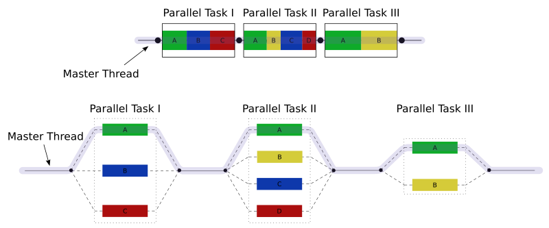

# 05 - Introdução a multi-core


Fonte: https://en.wikipedia.org/wiki/File:Fork_join.svg

Como visto em aula, o modelo *fork-join* segue três passos básicos:

1. Dividir o problema em pedaços
2. Resolver cada pedaço individualmente
3. Juntar as respostas parciais em um resultado final

Vamos criar uma implementação raiz desse modelo usando threads em C++11. 

## Parte 1 - o cabeçalho `thread`

Nesta parte iremos aprender a criar threads e esperar sua finalização usando C++11 [`std::threads`](http://www.cplusplus.com/reference/thread). Veja abaixo um exemplo com as funções que precisaremos usar (arquivo *exemplo1-threads.cpp*).

```cpp
--8<-- "05-intro-multi-core/exemplo1-threads.cpp"
```

!!! example
	Compile e roda o programa acima. O resultado é o esperado?

!!! example
	Modifique o programa acima para criar 4 threads e atribuir a cada uma um *id* de 0 a 3. Cada thread deve executar uma função que imprime "Thread: " + id. (Você precisa ainda da variável `int *b`?)

!!! question short
	Pesquise como detectar o máximo de threads de hardware e incorpore esta informação no seu programa acima. Ele deverá criar este número de threads. Escreva a chamada usada abaixo.

!!! example
	Modifique seu programa acima para retornar um o *id* da thread ao quadrado. Como você faria isto? Como você guardaria essa informação no `main`? **Dica**: *exemplo1-threads.cpp* faz isso com a variável `b`.

!!! example
	Faça sua função `main` mostrar a soma dos quadrados dos valores recebidos no item anterior. 

## Parte 2 - paralelizando uma operação de complexa

Vamos agora paralelizar um problema mais complexo: o cálculo do *pi*. O arquivo *pi-numeric-integration.cpp* contém uma implementação sequencial usando a técnica de integração numérica vista nos slides. Seu trabalho será:

1. dividir o trabalho desta função em 4 threads, cada uma computando uma parte da sequência
1. salvar os resultados parciais de cada thread em um elemento de um vetor criado no `main`
1. somar os resultados parciais.

Seu programa deverá apresentar resultado similar ao programa sequencial, mas funcionar em aproximadamente um quarto do tempo.

!!! warning
	Este trabalho está com uma descrição vaga de propósito. É parte dos objetivos entender o código sequencial dado como exemplo e como dividir os trabalhos entre as threads. 
