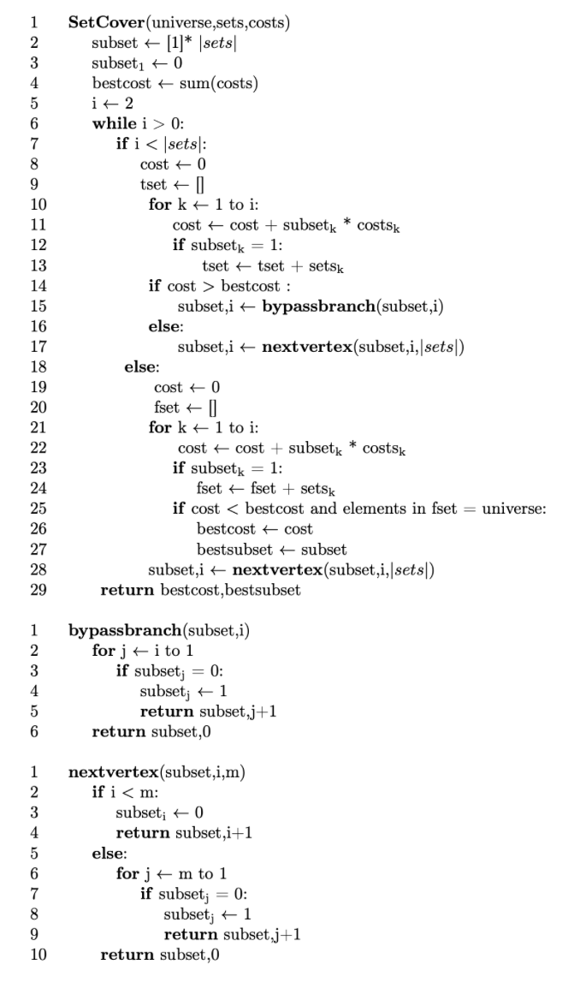

# Solução Busca exaustiva - Branch and Bound

Faça agora uma implementação de busca exaustiva para o problema do min-set-cover. Assuma inicialmente que todos os subconjuntos são necessários. Para cada subconjunto da solução, remova ele a solução em questão e verifique se a propriedade de cobertura é mantida. Faça isso para todos os elementos na ordem do vetor de soluções, enquanto a propriedade for válida. Se a propriedade ficar inválida, você deve interromper essa linha de processamento, executando então uma nova estrutura de possibilidades em que considera esse conjunto vital para a continuidade do problema. 

Para auxiliar na sua implementação, você pode se basear no pseudocódigo abaixo. Assuma que custos é um vetor unitário de cardinalidade igual ao vetor que armazena os subconjuntos. Há um programa Python disponibilizado neste [link](https://colab.research.google.com/drive/1PdJo7henY_P4BnDBKGm9b0himbm8MPMd?usp=sharing) para que você possa simular a implementação desse pseudocódigo. 

Avalie: Há garantia de que o resultado ótimo é obtido? Justifique. 

