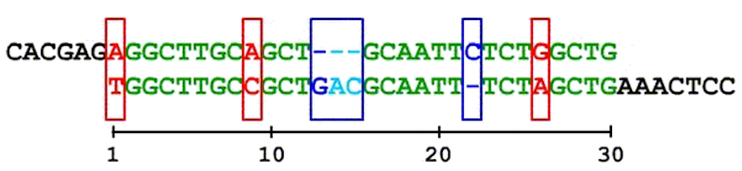

# Alinhamento de Sequencias de DNA

Em Bioinformática, o problema de **alinhamento de sequências de DNA** consiste no processo de comparar duas ou mais sequências de bases de forma a se observar seu nível de similaridade. Trata-se de um problema extremamente importante no contexto atual, pois permite comparar sequencias virais de SARS-COV2 em bancos de dados genômicos para detecção de novas mutações.

O nível de similaridade pode ser calculado com base em **acertos (match)** e **erros (gap e mismatch)**. Os acertos contribuem com sinal positivo (+) para o nível de similaridade e, os erros, com sinal negativo (-). Abaixo temos um exemplo de cálculo do nível similaridade:



Vamos associar a pontuação **+1 (match)** e as penalidades **-1 (gap)** e **-4 (mismatch)**. Assim, teremos o seguinte nível de similaridade:

23 matches x (+1) + 4 gaps x (-1) + 3 mismatches x (-4) = 23-4-12 = 7

Neste contexto, o problema de alinhamento de sequencias de DNA pode ser colocado da seguinte forma:

```
Dadas duas sequencias de DNA, com as bases A,T,G,C e - para indicar gap, 
encontrar o alinhamento que maximize o nível de similaridade. 
```


Neste projeto, seu objetivo será construir programas para encontrar este alinhamento de nível máximo de similaridade, utilizando várias estratégias. 

Cada um dos seus programas tomará como entrada a seguinte estrutura: a primeira linha contém dois números `n` e `m`, onde `n` é o tamanho da primeira sequencia e, `m`, o tamanho da segunda. Assuma `n ≤ 200` e `m ≤ 200`. A segunda linha contém as bases da primeira sequencia e, a terceira linha, as bases da segunda.

```
5 7
AT-CC
TTTCCAA
```

A saída deve ser uma linha com um número inteiro indicando o nível máximo de similaridade.

```
2
```
Neste caso, este nível máximo de similaridade pode ser associado ao alinhamento T-CC/TTCC (1-1+1+1=2) ou a CC/CC(1+1=2). Você pode usar o notebook SequenceGenerator.ipynb para gerar instâncias aleatórias para seus testes.


## Estratégias a serem estudadas e correção automática

Para cada estratégia que vamos estudar, implementaremos um programa correspondente no projeto. Veja abaixo as datas de entrega e descrições de cada estratégia a ser implementada. Em geral, o enunciado de uma parte é liberado após a data de entrega da parte anterior.

1. [Solução Heurística](heuristico.md) (18/03)
2. [Busca Local](busca-local)(01/04)
3. [Busca Exaustiva](busca-exaustiva)(15/04)
4. [Relatório Preliminar](relatorio-1) (29/04)
5. [Paralelismo Multicore](paralelismo-multicore) (13/05)
6. [Paralelismo GPU](paralelismo-gpu) (27/05)
7. [Relatório Final](relatorio-2) (03/06)

<!-- 1. [Solução Heurística](heuristico) (23/03)
2. [Busca local](busca-local) (09/04)
3. [Busca exaustiva](busca-exaustiva) (16/04)
4. [Relatório preliminar](relatorio-1) (30/04)
5. [Paralelismo MultiCore](paralelismo-multicore) (21/05) -->
<!-- 
Cada parte de implementação será conferida usando um script de correção checagem de resultados disponível no repositório de entregas do projeto, juntamente com instruções de uso. Registre seu usuário do github até **15/03** para ser convidado para seu repositório de entregas.

<iframe width="640px" height= "480px" src= "https://forms.office.com/Pages/ResponsePage.aspx?id=wKZwY5B7CUe9blnCjt6DO36bxJ3XetxChDUDKdweTOJURUNKWkFLSklHNk1RWlVBTUNHWEszVExOViQlQCN0PWcu&embed=true" frameborder= "0" marginwidth= "0" marginheight= "0" style= "border: none; max-width:100%; max-height:100vh" allowfullscreen webkitallowfullscreen mozallowfullscreen msallowfullscreen> </iframe>

### Instruções de correção

O corretor automático depende do pacote `grading-tools`, que deverá ser instalado como abaixo.

```shell
$> python3.8 -m pip install --user git+https://github.com/igordsm/grading-tools
```

??? tip "Python 3.8 no Ubuntu"
    Se seu `python3` é uma versão inferior ao 3.8, você pode instalá-lo com os pacotes abaixo:

    ```
    python3.8 python3.8-dev
    ```

    A partir daí poderá seguir normalmente as instruções desta página.

Com isso configurado, é só compilar seu programa e rodar `python3.8 corretor.py executavel`. Para baixar os novos exercícios é só rodar `git pull`. Os exercícios serão entregues criando um commit com sua resposta e dando `git push`.


!!! warning
    Fique atento a atualizações no seu repositório de projeto. Atualizações no corretor serão feitas ao longo do semestre, assim como serão disponibilizados novos arquivos de entrada/saída para cada parte a ser implementada. -->

## Avaliação

O projeto será avaliado usando rubricas para as entregas básicas. As rubricas de avaliação dos relatórios estarão descritas em suas páginas de entrega.

### Conceito D

Algum dos seguintes itens não foi entregue corretamente ou possui problemas sérios (no caso do relatório final).

1. Solução heurística
2. Busca local
3. Busca exaustiva
4. Busca local paralela (CPU)
5. Busca local paralela (GPU)
6. Relatório preliminar
7. Relatório final


### Conceito C

Todas as atividades abaixo foram validadas pelo corretor e (no caso do relatório final) alcançaram qualidade mínima exigida.

1. Solução heurística
2. Busca local
3. Busca exaustiva
4. Busca local paralela (CPU)
5. Busca local paralela (GPU)
6. Relatório preliminar
7. Relatório final

### Conceito C+

Além do já validado no conceito **C**, os relatórios entregues não tinham nenhum ponto **em desenvolvimento** ou **insatisfatório** na rubrica do relatório.

### Conceitos avançados

A partir do  conceito **C+** cada atividade avançada vale meio conceito. Elas serão listadas aqui conforme o semestre avança e serão testadas pela checagem de resultados disponível no repositório de entregas.
