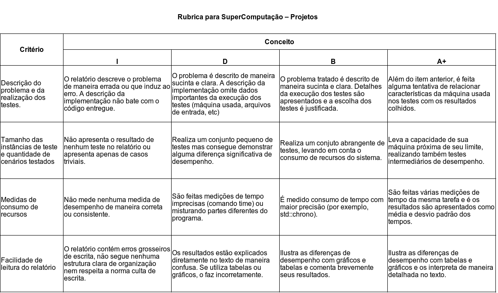

% Super Computação
% Igor Montagner, Luciano Soares
% 2019/2

# Projeto 2 - Multi-core

Neste projeto iremos trabalhar em uma área chamada Otimizacão discreta, que estuda problemas de otimizacão em que as variáveis correspondem a uma sequência de escolhas e que tem uma característica especial: a solucão ótima só pode ser encontrada se enumerarmos todas as escolhas possíveis, Ou seja: não existem algoritmos eficientes para sua resolucão. Isto significa que todo algoritmo para sua solucão é $O(2ˆn)$ ou pior. Inclusive, ao recebermos uma solucão só conseguimos saber se ela é a melhor se olhando para todas as outras de novo! 

Claramente, estes problemas são interessantes para computacão paralela: podemos diminuir seu consumo de tempo consideravelmente se realizarmos testes em paralelo. 

# Parte 0 - o problema

Um problema muito popular na área de logística é o Caixeiro Viajante:

> Um vendedor possui uma lista de empresas que ele deverá visitar em um certo dia. Não existe uma ordem fixa: desde que todos sejam visitados seu objetivo do dia está cumprido. Interessado em passar o maior tempo possível nos clientes ele precisa encontrar a sequência de visitas que resulta no menor caminho. 

{ width=300px }

Vamos assumir que:

* o nosso caixeiro usa Waze e já sabe qual é o caminho com a menor distância entre dois pontos;
* ele começa seu trajeto na empresa `0`. Ou seja, basta ele encontrar um trajeto que passe por todas as outras e volte a empresa `0`;
* ele não pode passar duas vezes na mesma empresa. Ou seja, a saída é uma permutação de `0 ... (N-1)`

Nosso trabalho será encontrar esse caminho e fornecê-lo ao vendedor. Note que esta mesma formulação pode ser usada (ou adaptada) para empresas de entregas com caminhões. 

# Parte 1 - implementacão

O arquivo *tsp.py* contém uma implementacão em Python do método de enumeracão exaustiva. Esta implementacão está correta, mas é claramente muito lenta e não consegue resolver problemas de tamanhos minimamente grandes. Seu trabalho será:

1. implementar uma versão sequencial em C++ deste método. O executável deverá ser chamado de *tsp-seq*
2. Estudar e implementar os seguintes métodos paralelos:
    * enumeracão exaustiva em paralelo
    * busca local paralela usando 2-opt
    * branch and bound (ou heuristic search)

Leia com atencão a secão de avaliacão para entender como a implementacão de cada método afetará suas notas.

## Material de suporte

Os métodos de busca local e branch and bound são "tradicionais" da área de otimizacão discreta e estão muito bem apresentados no curso [Discrete Optimization](https://www.coursera.org/learn/discrete-optimization/home/week/1). Este curso pode ser visto gratuitamente no Coursera e possui vídeos bastante didáticos para ambos os métodos. 

**Importante**: a implementação de ambos só é necessária para conceitos maiores que **C**. Ou seja, você não vai reprovar por não saber um pouco de otimização discreta. Por outro lado, é preciso algum envolvimento com as particularidades de cada área para que possamos criar programas realmente velozes. 

# Parte 2 - testes e relatório

A entrada de nosso programa será um conjunto de `N` pontos `x_i, y_i`. 

O formato de entrada será 

    N
    x_0 y_0
    ....
    x_(N-1) y_(N-1)

O custo de ir da empresa `i` até a empresa `j` é a distância euclidiana entre seus pontos.

O formato de saída será 

    dist opt
    0 e_1 ... e_(N-1)

* `dist` é o comprimento do caminho encontrado usando 5 casas decimais.
* `e_1 ... e_(N-1)` é a sequência de empresas visitadas no trajeto
* `opt` é `1` se a solução encontrada é a ótima e `0` se foi usada outra estratégia

\newpage

# Parte 3 - requisitos de projeto

Se os requisitos de projeto abaixo não forem cumpridos sua nota máxima será **D**. 

- [ ] CMakeLists.txt que gere um executável por método testado
- [ ] Relatório feito em Jupyter Notebook  ou PWeave. Seu relatório deve conter as seguintes seções: 
    - [ ] Descrição do problema tratado
    - [ ] Descrição dos testes feitos (tamanho de entradas, quantas execuções são feitas, como mediu tempo)
    - [ ] Organização em alto nível de seu projeto.
- [ ] Versão já rodada do relatório exportada para *PDF*
- [ ] README.txt explicando como rodar seus testes
- [ ] Conjunto de testes automatizados (via script Python ou direto no relatório)
- [ ] Respeitar os formatos de entrada e saída definidos na seção anterior

# Parte 4 - avaliacão

Este projeto seguirá o mesmo esquema de avaliacão do primeiro. 

## Implementação

Sua implementação seguirá a seguinte rubrica. 

* **I**: Não compila. 
* **D**:
    - implementou a versão em C++ de `tsp.py`
    - paralelização deste método está incorreta
* **C**:
    - paralelizou de maneira inocente `tsp.py` e obtém o mesmo resultado. 
* **+2,0**:
    - implementou busca local usando 2-opt corretamente e gerou solução sub-ótima
* **+2,0**:
    - implementou branch and bound ou heuristic search corretamente e gerou solução ótima
* **+1,0**:
    - fez solução híbrida busca local + branch and bound. 
* **+1,0**: 
    - implementou alguma otimização que reduz o tempo do algoritmo exaustivo **sequencial** e que pôde ser portada para alguma versão paralela.

## Relatório e testes

O relatório seguira uma rubrica contendo diversos itens. A nota final de relatório é a média das notas parciais, levando em conta a seguinte atribuição de pontos.

* **I** - 0 pontos: Não fez ou fez algo totalmente incorreto.
* **D** - 4 pontos: Fez o mínimo, mas com diversos pontos para melhora.
* **B** - 7 pontos: Fez o esperado. Não está fantástico, mas tem qualidade. 
* **A+** - 10 pontos: Apresentou alguma inovação ou evolução significativa em relação ao esperado.

## Desafio

O arquivo *berlin52.in* contém um problema de tamanho grande para nossa implementação em Python. O aluno que obtiver o melhor desempenho neste . Se todos obtiverem bom desempenho cresceremos o tamanho do problema com outras instâncias do site [TSPlib](https://www.iwr.uni-heidelberg.de/groups/comopt/software/TSPLIB95/tsp/).

